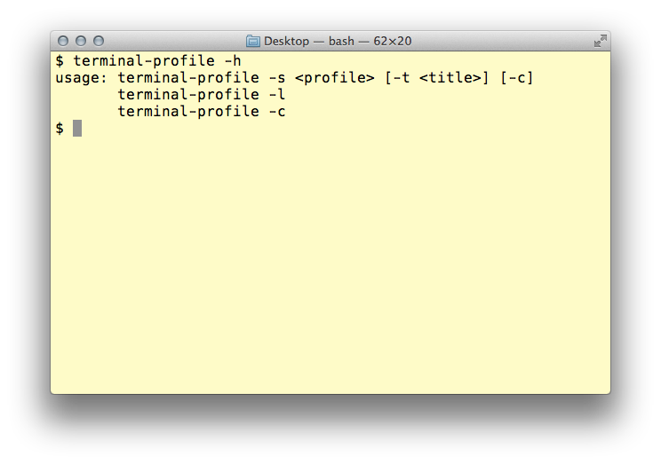
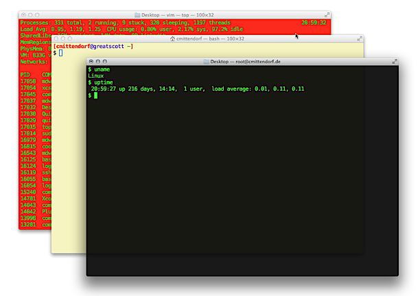

Introduction
============

A command line tool that changes the style of your current tab in Terminal.app on Mac OS X. This tools is largely inspired by an AppleScript? from the Omni Group. That script was broken when Snow Leopard came out, however there is now an updated for the script available from the Omni Group. Too bad that I found the update after I had written this helper. Though it was a nice learning example for using the ScriptingBridge Framework.



See the following blog post for further information on the original AppleScript:

http://blog.omnigroup.com/2007/11/03/terminal-scripting-in-105/

I'd like to give a big thank you to the Omni Group for creating great apps for the Mac platform and for sharing their knowledge with the community.

https://www.youtube.com/watch?v=YnHFv05JkYg


Environment and Usage Information
=================================

This tool is written in Objective-C and uses the ScriptingBridge Framework for interacting with the Terminal.app Application. It was tested on Mac OS X Snow Leopard and may be broken with other Terminal.app versions of previous system versions.

    $ ./SetTerminalStyle -h
    usage: SetTerminalStyle -s <style> [-t <title>] [-c]
           SetTerminalStyle -l
           SetTerminalStyle -c

The parameters available are:

    -s The name of the style.
    -t An alternative title for the tab.
    -c Returns the launch style of the tab.
    -l Lists all style configured in Terminal.app and marks the default with a "."

You may add the following functions to your .bashrc or alternative shell init script, which will change the terminal window style according to the command you are executing. The following example for instance uses a style name "ssh" for remote ssh connections, a style named "vim" for editing files using vim or a style name "sudo" for all commands executed using sudo:

```bash
if [ "$TERM_PROGRAM" = "Apple_Terminal" ]; then
    function ssh {
        STYLE=$(SetTerminalStyle -s ssh -t "$1" -c)
        /usr/bin/ssh "$@"
        SetTerminalStyle -s "${STYLE}" 
    }
    function vim {
        STYLE=$(SetTerminalStyle -s vim -t "$1" -c)
        /usr/bin/vim "$@"
        SetTerminalStyle -s "${STYLE}"
    }
    function sudo {
        STYLE=$(SetTerminalStyle -c -s sudo -t "$1")
        /usr/bin/sudo "$@"
        SetTerminalStyle -s "${STYLE}" 
    }
    function man {
        STYLE=$(SetTerminalStyle -c -s man -t "$1")
        /usr/bin/man "$@"
        SetTerminalStyle -s "${STYLE}" 
    }
fi
```



You now have to add the three styles "ssh", "vim" and "sudo" to your Terminal.app configuration and you're done. When you now call a remote session with ssh or when you open your vim editor, the style of your terminal tab changes to the named settings.

Build Instructions
==================

Simply check out the subversion project and call make in the directory. You may install the tool using make install or simply do a cp to your preferred location.

For using another applications scripting definition we have to convert its sdef file to a header file that will contain all necessary information about the applications scripting features. For the conversion we need two command line tools: sdef and sdp. The necessary script is added as a "Run Script" build step in Xcodes definition of target build phases.

    sdef /Applications/Utilities/Terminal.app | \
    /usr/bin/sdp -fh -o . --basename "Terminal" --bundleid "com.apple.Terminal"
